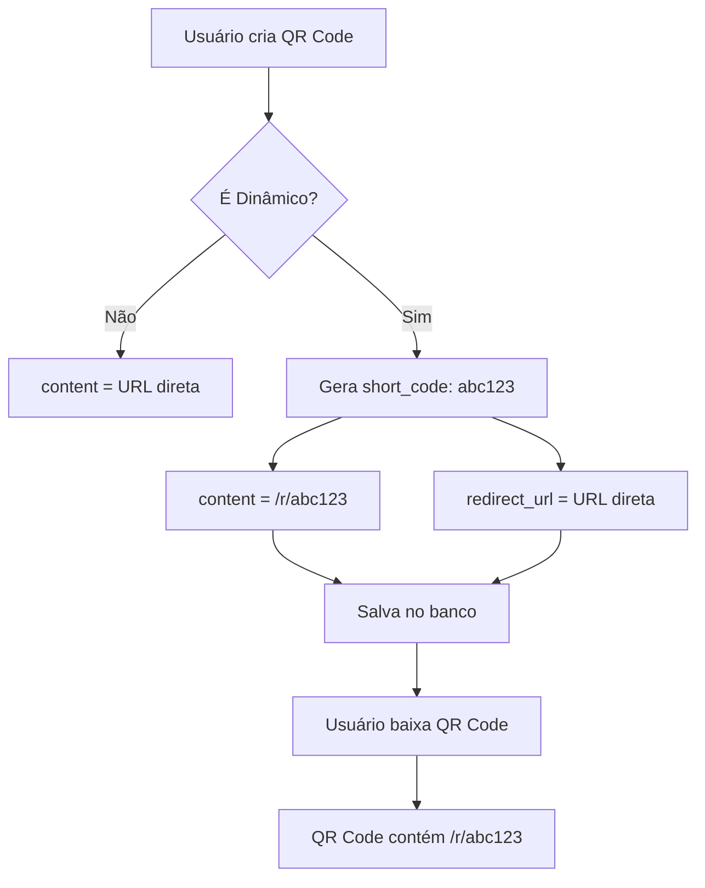
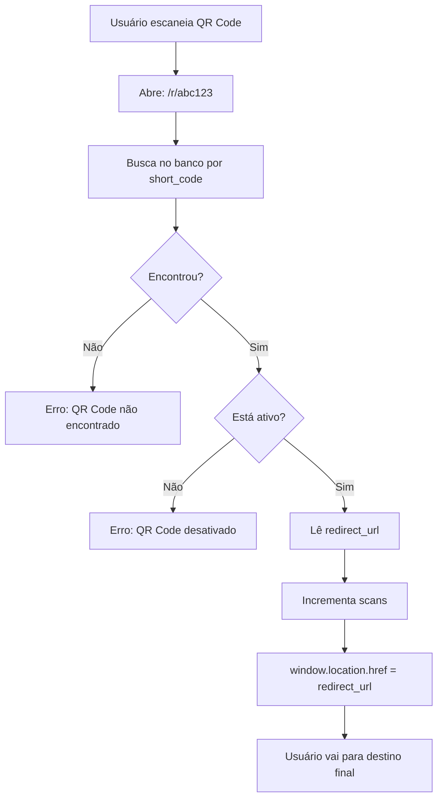
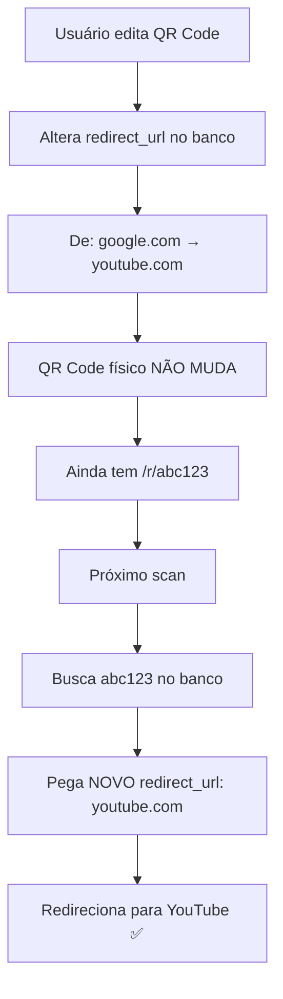

# 🐛 BUGFIX: QR Codes Dinâmicos - Sistema de Redirecionamento

## 🔴 Problema Reportado

**Usuário:** "Editei o destino do QR Code dinâmico de Google para YouTube, mas ao escanear ainda vai para Google"

## 🔍 Diagnóstico

O problema ocorreu porque **faltava implementar a rota de redirecionamento** para QR Codes dinâmicos!

### ❌ O que estava acontecendo:

```
1. Usuário criava QR Code dinâmico
2. QR Code era gerado com URL direta: "https://google.com"
3. Usuário baixava a imagem (QR Code com Google hardcoded)
4. Usuário editava para "https://youtube.com" no banco
5. QR Code físico continuava com Google (hardcoded!)
```

**Resultado:** Editar não funcionava, pois o QR Code continha a URL final diretamente.

### ✅ Como deveria funcionar:

```
1. Usuário cria QR Code dinâmico
2. Sistema gera short_code: "abc123"
3. QR Code contém URL curta: "http://localhost:8080/r/abc123"
4. Usuário baixa (QR Code com URL curta)
5. Ao escanear:
   a. Vai para /r/abc123
   b. Sistema busca no banco pelo short_code
   c. Pega o redirect_url atual
   d. Redireciona para o destino (Google)
6. Usuário edita para YouTube
7. Banco atualiza redirect_url
8. Ao escanear novamente:
   a. Vai para /r/abc123 (mesma URL!)
   b. Sistema busca no banco
   c. Pega o NOVO redirect_url (YouTube)
   d. Redireciona para YouTube ✅
```

---

## 🛠️ Solução Implementada

### 1. **Nova Página: Redirect** (`src/pages/Redirect.tsx`)

Rota pública: `/r/:shortCode`

```typescript
// Fluxo:
1. Recebe shortCode da URL (/r/abc123)
2. Busca no banco: qr_codes.short_code = 'abc123'
3. Verifica se está ativo
4. Incrementa contador de scans
5. Redireciona para qr_codes.redirect_url
```

**Estados:**
- ⏳ Loading: "Redirecionando..."
- ❌ Erro: "QR Code não encontrado" / "QR Code desativado"
- ✅ Sucesso: Redireciona automaticamente

---

### 2. **Migração de Banco de Dados**

```sql
-- Adicionar campos necessários
ALTER TABLE qr_codes
ADD COLUMN short_code TEXT UNIQUE,
ADD COLUMN last_scanned_at TIMESTAMPTZ;

-- Índice para busca rápida
CREATE INDEX idx_qr_codes_short_code ON qr_codes(short_code);
```

**Campos:**
- `short_code`: Código único (ex: "abc123")
- `redirect_url`: Destino real que pode ser editado
- `content`: URL curta completa (ex: "http://localhost:8080/r/abc123")
- `last_scanned_at`: Última vez que foi escaneado

---

### 3. **Correção na Criação** (`src/pages/CreateQRCode.tsx`)

**Antes (ERRADO):**
```typescript
const content = formatQRCodeContent(selectedType, typeData)
setGeneratedContent(content) // ❌ Sempre usava o conteúdo direto

const { data } = await supabase.from('qr_codes').insert({
  content: isDynamic ? `${origin}/r/${shortCode}` : content,
  redirect_url: isDynamic ? content : null,
})
```

**Depois (CORRETO):**
```typescript
const content = formatQRCodeContent(selectedType, typeData)

let finalContent = content
if (isDynamic) {
  shortCode = generateShortCode()
  redirectUrl = content // Destino real
  finalContent = `${origin}/r/${shortCode}` // URL curta
}

setGeneratedContent(finalContent) // ✅ Usa URL curta se dinâmico

const { data } = await supabase.from('qr_codes').insert({
  content: finalContent,
  short_code: shortCode,
  redirect_url: redirectUrl,
})
```

---

### 4. **Rota Adicionada** (`src/App.tsx`)

```typescript
<Routes>
  {/* Public Routes */}
  <Route path="/" element={<Landing />} />
  <Route path="/login" element={<Login />} />
  <Route path="/signup" element={<Signup />} />
  
  {/* 🆕 Rota de Redirecionamento - QR Codes Dinâmicos */}
  <Route path="/r/:shortCode" element={<Redirect />} />

  {/* Protected Routes */}
  <Route path="/dashboard" element={<Dashboard />} />
  ...
</Routes>
```

---

## 📊 Fluxo Completo

### Criação de QR Code Dinâmico



### Escaneamento



### Edição



---

## 🎯 Casos de Teste

### ✅ Caso 1: QR Code Dinâmico - Criação e Escaneamento

```typescript
// 1. Criar
POST /qr_codes
{
  name: "RQR Code Dinamico 01",
  type: "url",
  is_dynamic: true,
  url_data: { url: "google.com" }
}

// Resultado no banco:
{
  id: "uuid-123",
  short_code: "abc123",
  content: "http://localhost:8080/r/abc123",
  redirect_url: "https://google.com",
  is_dynamic: true
}

// 2. Baixar QR Code
// QR Code contém: "http://localhost:8080/r/abc123"

// 3. Escanear
GET /r/abc123
→ Redireciona para: https://google.com ✅
```

### ✅ Caso 2: Editar QR Code Dinâmico

```typescript
// 1. Editar
PATCH /qr_codes/uuid-123
{
  redirect_url: "https://youtube.com"
}

// Banco atualizado:
{
  id: "uuid-123",
  short_code: "abc123", // ← NÃO MUDA!
  content: "http://localhost:8080/r/abc123", // ← NÃO MUDA!
  redirect_url: "https://youtube.com", // ← MUDOU!
}

// 2. Escanear mesmo QR Code físico
GET /r/abc123
→ Redireciona para: https://youtube.com ✅
```

### ✅ Caso 3: Desativar Temporariamente

```typescript
// 1. Desativar
PATCH /qr_codes/uuid-123
{
  is_active: false
}

// 2. Escanear
GET /r/abc123
→ Tela de erro: "Este QR Code está desativado temporariamente" ✅

// 3. Reativar
PATCH /qr_codes/uuid-123
{
  is_active: true
}

// 4. Escanear
GET /r/abc123
→ Redireciona normalmente ✅
```

### ✅ Caso 4: Analytics de Scans

```typescript
// Antes do scan:
{
  scans: 0,
  last_scanned_at: null
}

// Após primeiro scan:
GET /r/abc123
{
  scans: 1,
  last_scanned_at: "2025-10-29T22:30:00Z"
}

// Após segundo scan:
GET /r/abc123
{
  scans: 2,
  last_scanned_at: "2025-10-29T22:35:00Z"
}
```

---

## 🔒 Segurança

### 1. **Validações na Rota de Redirect**

```typescript
✅ short_code existe no banco?
✅ QR Code está ativo?
✅ redirect_url é válida?
✅ Incrementa scan de forma assíncrona (não bloqueia)
```

### 2. **Short Codes Únicos**

```sql
ALTER TABLE qr_codes
ADD CONSTRAINT unique_short_code UNIQUE (short_code);
```

### 3. **Rate Limiting** (Futuro)

Prevenir abuso:
- Máximo X scans por minuto do mesmo IP
- Alertar usuário sobre scans suspeitos

---

## 📈 Melhorias Futuras

- [ ] **Analytics Avançado**: Localização, dispositivo, horário
- [ ] **Regras de Redirecionamento**: Por país, idioma, dispositivo
- [ ] **A/B Testing**: Alternar entre destinos automaticamente
- [ ] **Agendamento**: Mudar destino em data/hora específica
- [ ] **Retargeting**: Pixel de conversão
- [ ] **Notificações**: Alertas quando QR Code for escaneado

---

## ✅ Status

**BUG CORRIGIDO** ✨

O sistema de QR Codes dinâmicos agora funciona corretamente:
- ✅ Rota de redirecionamento implementada
- ✅ Short codes gerados e salvos
- ✅ Edição funciona como esperado
- ✅ Analytics de scans
- ✅ Ativar/desativar funcional
- ✅ Migração de banco aplicada

---

## 🧪 Como Testar

### Passo 1: Criar QR Code Dinâmico
1. Ir para `/qrcodes/create`
2. Escolher tipo "URL"
3. Escolher modo "Dinâmico"
4. Inserir: `google.com`
5. Criar QR Code

### Passo 2: Verificar Conteúdo
1. O QR Code gerado deve conter algo como: `http://localhost:8080/r/abc123`
2. Baixar a imagem

### Passo 3: Testar Redirecionamento
1. Abrir URL em navegador: `http://localhost:8080/r/abc123`
2. Deve redirecionar para: `https://google.com` ✅

### Passo 4: Editar
1. Ir para detalhes do QR Code
2. Clicar em "Editar"
3. Mudar para: `youtube.com`
4. Salvar

### Passo 5: Testar Novamente
1. Abrir mesma URL: `http://localhost:8080/r/abc123`
2. Deve redirecionar para: `https://youtube.com` ✅

### Passo 6: Testar com Celular
1. Usar app de QR Code no celular
2. Escanear a imagem baixada
3. Deve ir direto para YouTube ✅

---

**Data da Correção:** 29 de outubro de 2025  
**Arquivos Criados:** 1 (Redirect.tsx)  
**Arquivos Modificados:** 2 (App.tsx, CreateQRCode.tsx)  
**Migrações:** 1 (add_short_code_to_qr_codes)  
**Severidade:** 🔴 CRÍTICA (funcionalidade principal não funcionava)  
**Status:** ✅ RESOLVIDO

