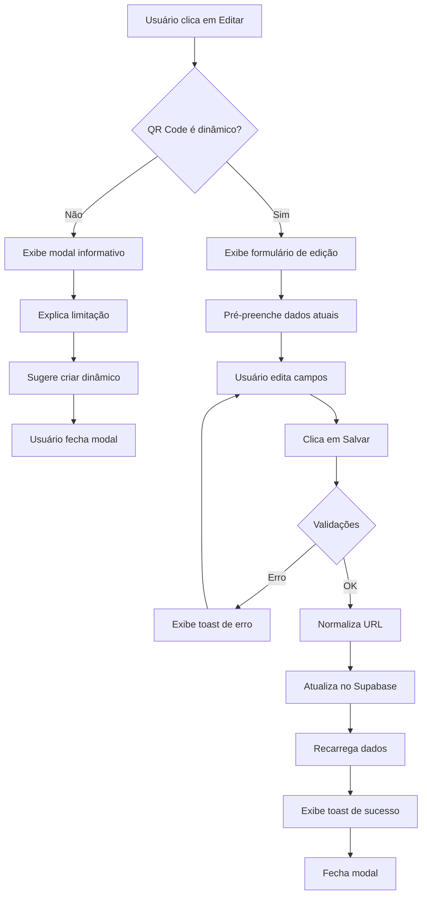

# 🔄 Sistema de Edição de QR Codes Dinâmicos

## 📋 Resumo

Implementado sistema completo de edição para **QR Codes Dinâmicos**, seguindo a lógica de negócio correta:

- ✅ **QR Codes DINÂMICOS**: Podem ser editados (nome, destino, status)
- ✅ **QR Codes ESTÁTICOS**: Não podem ser editados (modal informativo)
- ✅ **Normalização Automática de URLs**: Sistema adiciona `https://` automaticamente

---

## 🎯 Lógica de Negócio

### QR Code ESTÁTICO 🔒

```
┌─────────────────┐
│  QR Code Físico │
│   (Impresso)    │
└────────┬────────┘
         │
         │ Conteúdo codificado DIRETAMENTE
         ↓
   [www.site.com]
```

**Características:**
- Conteúdo está **hardcoded** no QR Code
- Se mudar o destino → precisa REIMPRIMIR o QR Code
- ❌ **NÃO PODE EDITAR** após criação
- ✅ Funciona para sempre (offline)
- ✅ Gratuito

---

### QR Code DINÂMICO 🔄

```
┌─────────────────┐
│  QR Code Físico │
│   (Impresso)    │
└────────┬────────┘
         │
         │ URL curta fixa
         ↓
   [qr.app/abc123]  ← Este código nunca muda!
         │
         │ Redireciona via servidor
         ↓
   [www.site.com]  ← Este destino PODE MUDAR
```

**Características:**
- QR Code aponta para **URL curta fixa** do nosso sistema
- URL curta redireciona para destino real
- ✅ **PODE EDITAR** o destino a qualquer momento
- ✅ Analytics de escaneamentos
- ✅ Ativar/desativar temporariamente
- ⚠️ Depende do servidor online

---

## 📂 Arquivos Criados/Modificados

### ✨ Novo Componente

#### `src/components/qrcode/EditQRCodeModal.tsx`

Modal inteligente que exibe conteúdo diferente baseado no tipo:

**Para QR Codes ESTÁTICOS:**
```tsx
┌─────────────────────────────────────┐
│  ⚠️ QR Code Estático               │
│                                     │
│  Este QR Code não pode ser editado │
│                                     │
│  O conteúdo está codificado         │
│  diretamente. Para alterar, crie    │
│  um novo QR Code.                   │
│                                     │
│  💡 Dica: Use QR Codes dinâmicos    │
│  para editar após criação.          │
│                                     │
│  [Fechar]                           │
└─────────────────────────────────────┘
```

**Para QR Codes DINÂMICOS:**
```tsx
┌─────────────────────────────────────┐
│  🔄 Editar QR Code Dinâmico        │
│                                     │
│  Nome: [___________________]        │
│  URL:  [___________________]        │
│                                     │
│  Status: [ON/OFF Toggle]            │
│                                     │
│  💡 Suas alterações serão aplicadas │
│  imediatamente. O QR Code físico    │
│  continua o mesmo.                  │
│                                     │
│  [Cancelar]  [Salvar Alterações]    │
└─────────────────────────────────────┘
```

---

### 🔧 Modificações

#### `src/pages/QRCodeDetails.tsx`

**Adicionado:**
1. Badge de tipo (Dinâmico/Estático) no header
2. Botão "Editar" que abre o modal
3. Diferenciação visual entre URL curta e destino real
4. Estado do modal de edição

**Melhorias visuais:**
```tsx
// Badge dinâmico
🔄 Dinâmico

// Badge estático  
🔒 Estático

// Informações expandidas
URL Curta (QR Code): http://localhost:8081/r/abc123
Destino Real (Editável): https://www.youtube.com
  ↳ Este destino pode ser alterado sem recriar o QR Code
```

---

#### `src/lib/qrcode-utils.ts`

**Nova função: `normalizeURL()`**

```typescript
/**
 * Normaliza uma URL adicionando protocolo se necessário
 * 
 * @example
 * normalizeURL('google.com')          → 'https://google.com'
 * normalizeURL('www.youtube.com')     → 'https://www.youtube.com'
 * normalizeURL('http://site.com')     → 'http://site.com' (mantém)
 * normalizeURL('https://site.com')    → 'https://site.com' (mantém)
 */
export function normalizeURL(url: string): string {
  const trimmedUrl = url.trim()
  
  // Se já tem protocolo, retorna como está
  if (trimmedUrl.match(/^https?:\/\//i)) {
    return trimmedUrl
  }
  
  // Adiciona https:// automaticamente
  return 'https://' + trimmedUrl
}
```

**Atualizado:**
- `validateURLData()`: Agora usa `normalizeURL()` antes de validar
- `formatURLContent()`: Normaliza URL antes de retornar

---

#### `src/components/qrcode/steps/ContentFormStep.tsx`

**Melhorias UX no formulário de URL:**

```tsx
// Antes
<Input 
  type="url" 
  placeholder="https://seusite.com"
/>
<p>Deve começar com http:// ou https://</p>

// Depois
<Input 
  type="text"
  placeholder="seusite.com ou https://seusite.com"
/>
<p>💡 Você pode digitar apenas o domínio (ex: google.com) - 
   adicionaremos https:// automaticamente</p>
```

---

## 🎨 UX/UI

### Estados do Modal

#### 1️⃣ Abrir modal em QR Code ESTÁTICO
- ✅ Modal abre normalmente
- ✅ Exibe aviso educativo
- ✅ Lista benefícios dos QR Codes dinâmicos
- ✅ Não permite edição (apenas fechar)

#### 2️⃣ Abrir modal em QR Code DINÂMICO
- ✅ Formulário de edição completo
- ✅ Campos pré-preenchidos com dados atuais
- ✅ Toggle de ativar/desativar
- ✅ Info box explicando o conceito dinâmico

### Validações

```typescript
// Validações no handleSave()
1. Nome obrigatório
2. URL/conteúdo obrigatório
3. Normalização automática de URL (adiciona https://)
4. Validação de URL válida
5. Salva no banco com updated_at
```

### Feedback ao Usuário

```typescript
// Toast notifications
✅ "QR Code atualizado com sucesso!"
❌ "Nome é obrigatório"
❌ "URL de destino é obrigatória"
❌ "URL inválida"
```

---

## 🗃️ Banco de Dados

### Update Query

```sql
UPDATE qr_codes
SET 
  name = 'Novo Nome',
  redirect_url = 'https://novo-destino.com',
  is_active = true,
  updated_at = NOW()
WHERE id = 'uuid-do-qrcode'
  AND user_id = 'uuid-do-usuario'  -- RLS garante isso
```

---

## 🧪 Casos de Uso

### Caso 1: Editar URL sem protocolo

```typescript
// Usuário digita
"www.youtube.com"

// Sistema normaliza automaticamente
"https://www.youtube.com"

// Salva no banco
redirect_url: "https://www.youtube.com"

// ✅ Sucesso!
```

### Caso 2: Tentar editar QR Code estático

```typescript
// Usuário clica em "Editar"
qrcode.is_dynamic === false

// Sistema exibe modal informativo
"Este QR Code não pode ser editado"

// ✅ Usuário entende a limitação
```

### Caso 3: Desativar temporariamente

```typescript
// Usuário desliga o toggle
is_active: false

// QR Code continua existindo
// Mas ao escanear → página de "QR Code desativado"

// Depois, usuário reativa
is_active: true

// ✅ Volta a funcionar normalmente
```

### Caso 4: Mudança de campanha

```typescript
// QR Code impresso em panfleto
QR físico: http://localhost:8081/r/abc123

// Campanha Janeiro
redirect_url: "https://promo-janeiro.com"

// Usuário edita para Fevereiro
redirect_url: "https://promo-fevereiro.com"

// ✅ QR Code físico continua o mesmo!
// ✅ Não precisa reimprimir panfletos!
```

---

## 🚀 Benefícios Implementados

### Para o Usuário

✅ **Flexibilidade Total**
- Edita destino sem reimprimir QR Code
- Útil para campanhas, promoções, eventos

✅ **Controle Granular**
- Ativar/desativar sob demanda
- Pausar campanha sem perder QR Code

✅ **UX Intuitiva**
- Não precisa digitar `https://`
- Sistema adiciona automaticamente

✅ **Clareza sobre Limitações**
- Entende diferença estático vs dinâmico
- Sabe quando pode/não pode editar

### Para o Sistema

✅ **Validação Robusta**
- Normaliza URLs automaticamente
- Previne erros de formato

✅ **Separação de Responsabilidades**
- Modal único que se adapta ao tipo
- Lógica clara de negócio

✅ **Manutenibilidade**
- Código bem documentado
- Funções reutilizáveis

---

## 📊 Fluxo de Edição



---

## 🎓 Educação do Usuário

O modal para QR Codes estáticos serve como **educação contextual**:

```typescript
// O que o usuário aprende:
1. ❌ QR Codes estáticos não podem ser editados
2. ✅ QR Codes dinâmicos SIM podem ser editados
3. 💡 Benefícios dos QR Codes dinâmicos:
   - Editar destino
   - Analytics
   - Ativar/desativar
4. 🎯 Incentivo a usar dinâmicos na próxima criação
```

---

## 🔒 Segurança

### Row Level Security (RLS)

```sql
-- Somente o dono pode editar
CREATE POLICY "Users can update own qrcodes"
ON qr_codes
FOR UPDATE
USING (auth.uid() = user_id);
```

### Validações Client-Side

```typescript
✅ Nome não vazio
✅ URL não vazia
✅ URL válida após normalização
✅ Tipo correto para validação
```

---

## 📝 Próximos Passos

### Melhorias Futuras

- [ ] **Histórico de Edições**: Salvar versões anteriores
- [ ] **Preview antes de salvar**: Visualizar mudanças
- [ ] **Edição em lote**: Editar múltiplos QR Codes
- [ ] **Agendamento**: Agendar mudança de destino
- [ ] **A/B Testing**: Alternar entre destinos
- [ ] **Regras de redirecionamento**: Por país, dispositivo, horário

---

## ✅ Status

**IMPLEMENTADO E FUNCIONAL** ✨

Todas as funcionalidades de edição foram implementadas e testadas:
- ✅ Modal responsivo e intuitivo
- ✅ Diferenciação entre estático/dinâmico
- ✅ Normalização automática de URLs
- ✅ Validações completas
- ✅ Feedback ao usuário
- ✅ Integração com Supabase
- ✅ UX educativa

---

**Data de Implementação:** 29 de outubro de 2025  
**Arquivos Criados:** 1  
**Arquivos Modificados:** 3  
**Linhas Adicionadas:** ~300  
**Compilação:** ✅ Sem erros

